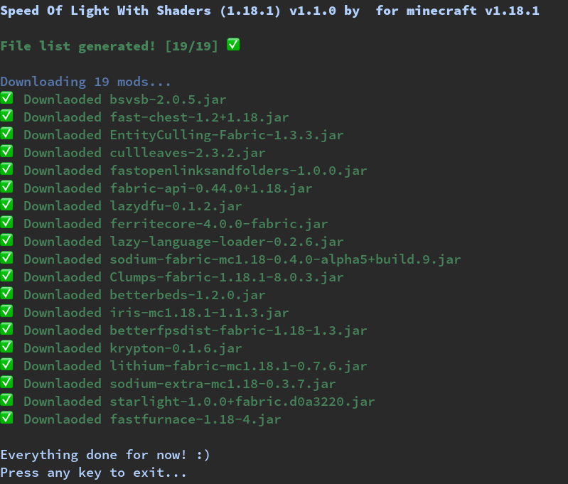

# curse-modpack-downloader
Download minecrfat modpacks without the twitch app

## How to
You just need to download the zip file with the manifest json and unzip it, it will create a new folder, then put the python file inside that folder and run it :)  
You may also need to install [colorama](https://pypi.org/project/colorama/) (pip install colorama in a terminal)

